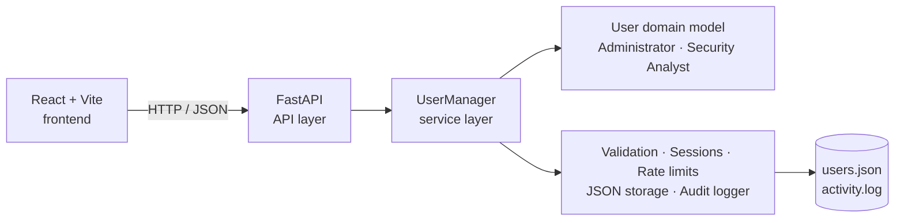

# Secure User Management System

> A full-stack, security-focused user-management application that demonstrates practical object-oriented programming with Python, FastAPI, React, and Vite.


## Overview

Secure User Management System (SUMS) is a Cyber Security Institute project built around a clean, layered architecture. It provides a React dashboard, a FastAPI REST API, a command-line demonstration, and an offline-friendly test workflow.

The project is intentionally designed to showcase OOP concepts alongside real security controls: encapsulation, inheritance, polymorphism, custom exceptions, password hashing, account lockouts, two-factor authentication, audit logging, and atomic persistence.

## Highlights

| Area | What it includes |
|---|---|
| User management | Create, list, authenticate, and unlock users with generated secure IDs. |
| Role-based access | `Administrator` and `Security Analyst` subclasses with role-specific privileges. |
| Authentication | Salted password hashes, rate limiting, account lockout, `HttpOnly` sessions, and optional TOTP 2FA. |
| Identity & audit | KYC status tracking, identity lookup, asynchronous activity logging, and activity reports. |
| Safe storage | Thread-safe in-memory registry and atomic JSON writes that avoid partially written user data. |
| Interfaces | React web app, FastAPI endpoints with interactive development docs, and a Python CLI demo. |

## Architecture



The interfaces stay separate from the business rules: both the CLI and the API use `UserManager`, while the domain layer owns user state and role behavior.

## Project structure

```text
backend/
├── api.py                 # FastAPI application and endpoints
├── main.py                # CLI demonstration
├── services/              # UserManager application service
├── users/                 # User, Administrator, SecurityAnalyst models
├── utilities/             # Validation, storage, TOTP, sessions, audit logging
├── exceptions/            # Typed application exceptions
├── test_system.py         # Core automated tests
└── run_offline_tests.py   # Isolated test runner
frontend/
├── src/                   # React pages, components, context, and API clients
├── public/                # Static assets
└── package.json
docs/                      # Project report, UML, and presentation outline
```

## Quick start

### 1. Run the backend

```powershell
cd backend
python -m pip install -r requirements.txt
uvicorn api:app --reload
```

The API starts at `http://127.0.0.1:8000`. In development, interactive API documentation is available at [`/docs`](http://127.0.0.1:8000/docs).

### 2. Run the frontend

In a second terminal:

```powershell
cd frontend
npm install
npm run dev
```

The frontend expects `http://127.0.0.1:8000` by default. To use a different API URL, copy `frontend/.env.example` to `frontend/.env` and update `VITE_API_URL`.

### 3. Create the first administrator

Copy [`.env.example`](.env.example) into your deployment environment and set a long, random `SUMS_BOOTSTRAP_KEY`. Then send a one-time request to `POST /setup/administrator`, including that secret as the `X-Setup-Key` header. The initial account must use the `Administrator` role.

```json
{
  "name": "System Administrator",
  "email": "admin@example.com",
  "password": "UseAStrongPassword1!",
  "role": "Administrator"
}
```

Once an account exists, the bootstrap endpoint is unavailable. Sign in through `POST /auth/login`; browser clients receive a secure `HttpOnly` session cookie.

## Testing

Run the core test suite without starting a server:

```powershell
python backend/run_offline_tests.py
```

The offline tests use temporary storage, so they do not modify `backend/data/`. You can also run the CLI demonstration directly:

```powershell
cd backend
python main.py
```

### Offline frontend mode

For UI-only work, launch the browser mock API:

```powershell
cd frontend
npm install
npm run dev:offline
```

This mode keeps users and audit events in browser local storage. Sign in with `ADMIN_DEMO01` and `DemoPass1!`. It is solely for interface testing and does not provide production security controls.

## API at a glance

| Endpoint | Purpose | Access |
|---|---|---|
| `GET /health` | Health check | Public |
| `POST /setup/administrator` | One-time first-admin setup | Bootstrap key |
| `POST /auth/login` · `POST /auth/logout` | Session lifecycle | Public / signed in |
| `GET` / `POST /users` | List or create users | Administrator |
| `POST /users/{user_id}/unlock` | Unlock an account | Administrator |
| `GET /reports/activity` | Read audit activity | Administrator or Security Analyst |
| `POST /2fa/*` | Enrol, confirm, or disable TOTP | Signed in |
| `POST /kyc/submit` · `GET /kyc/status` | Manage KYC status | Signed in |

## Security notes

- Passwords are stored only as salted hashes and are never returned in API responses.
- Failed login attempts lock an account after three failures; login requests are also rate-limited per IP address.
- Sessions use `HttpOnly`, `SameSite=Strict` cookies for browser clients.
- The API applies CORS and trusted-host checks, request-size limits, restrictive response headers, and HTTPS enforcement in production.
- JSON persistence is appropriate for this single-instance educational project. For a multi-worker or internet-facing deployment, use a database plus shared session and rate-limit storage such as Redis.
- Never commit real secrets or runtime user data. Set explicit production `SUMS_CORS_ORIGINS` and `SUMS_ALLOWED_HOSTS` values—never wildcards.

## Documentation

- [Project report](docs/PROJECT_REPORT.md)
- [UML class diagram](docs/UML_CLASS_DIAGRAM.md)
- [Presentation outline](docs/PRESENTATION_SLIDES.md)

---

Built as an object-oriented security project for the Cyber Security Institute.
