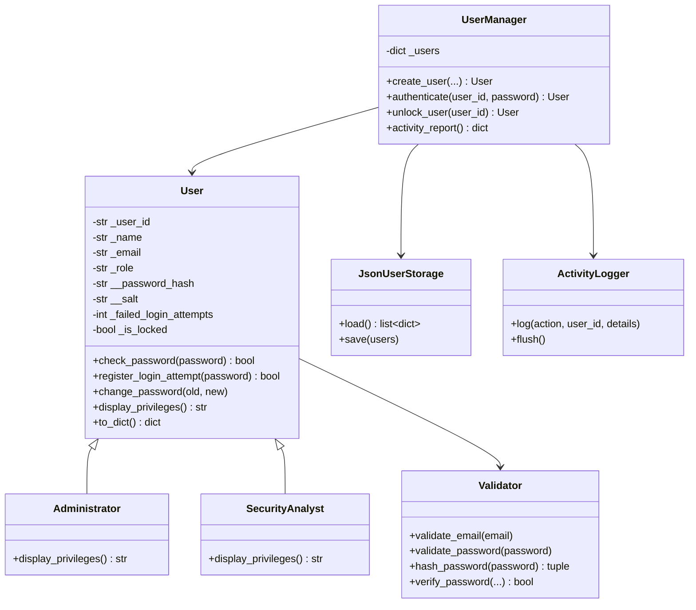

# UML Class Diagram

`Administrator` and `SecurityAnalyst` are specializations of `User`. Calling `display_privileges()` on a mixed list invokes each object’s overridden implementation at runtime, demonstrating polymorphism.
